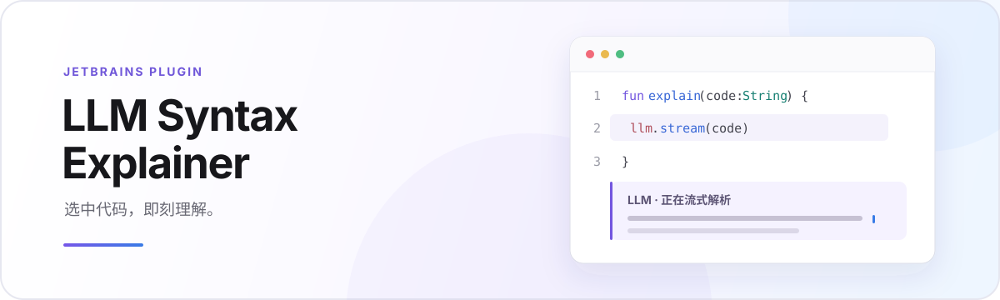

<div align="center">



</div>

## 特点

- **选中即解析**：选区稳定 600ms 后自动开始
- **就地显示**：结果出现在代码下方的虚拟行，不修改源文件
- **真实流式输出**：内容随模型响应逐步展示
- **连续追问**：回答下方直接输入问题，按 `Enter` 携带完整上下文继续对话
- **通用模型接口**：支持 OpenAI、DeepSeek、Ollama 等兼容服务

适用于 PyCharm、IntelliJ IDEA、WebStorm、GoLand 等 JetBrains IDE。

## 快速开始

1. 打开 `Settings → Plugins`
2. 点击齿轮，选择 `Install Plugin from Disk...`
3. 选择 `build/distributions/jetbrains-llm-syntax-explainer-0.1.1.zip`
4. 重启 IDE
5. 打开 `Settings → Tools → Code Syntax LLM` 完成模型配置

### DeepSeek 配置

| 配置项 | 填写内容 |
| --- | --- |
| Base URL | `https://api.deepseek.com` |
| API Key | DeepSeek 平台创建的 `sk-...` |
| Model | `deepseek-v4-flash` |

填写后点击“测试连接”。选中任意代码并停留片刻，解析结果会显示在选区下方。回答完成后可在输入框中继续追问；点击编辑器其他位置即可清空整段对话。

也可以右键选择“用 LLM 解析所选代码”，或按 `Alt+Shift+E` 手动触发。

## 隐私

插件只读取当前选中的代码，不读取文件的其他内容。请求会发送所选代码、你的追问以及当前对话历史；对话仅保存在内存中，点击编辑器其他位置或关闭编辑器后即清除。API Key 通过 JetBrains `PasswordSafe` 保存，不写入项目配置或 Git。

## 项目结构

```text
src/
├── main/
│   ├── kotlin/com/hesl/syntaxexplainer/
│   │   ├── editor/      选区监听、请求调度与 Block Inlay 渲染
│   │   ├── llm/         提示词、OpenAI 请求与 SSE 流解析
│   │   └── settings/    配置页、参数校验与 API Key 存储
│   └── resources/META-INF/
│       └── plugin.xml   插件入口、设置页和编辑器操作声明
└── test/kotlin/         核心请求、提示词和配置校验测试
```

项目保持单模块结构，不依赖 Docker、Python 服务或独立后端。
